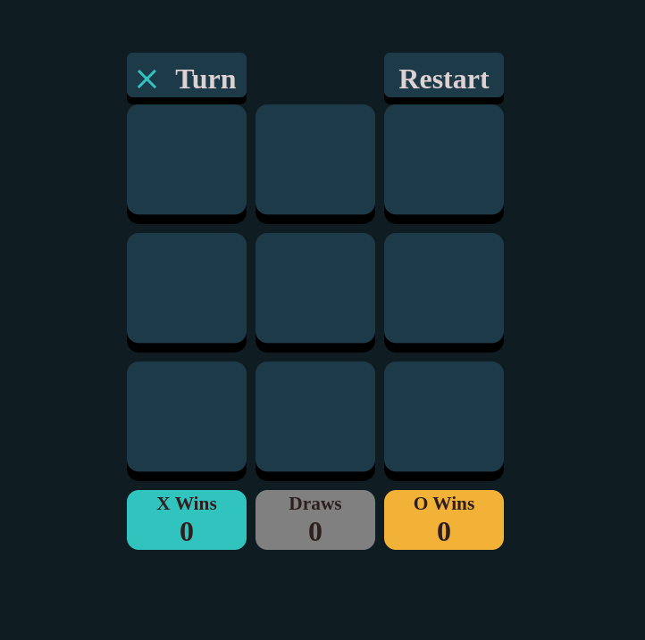

# Tic Tac Toe Game

## Description 
This is simple web game of Tic Tac Toe made with Javascript. 

## Features
- Score counter and reset 
- Can be played both on PC or Mobile layout
- Win state modal

## Try it out: 
https://tykejmi-tictactoe.netlify.app

## Technologies used:
- HTML5
- CSS3
- JS

### To be added 
- AI

## Credits
- This project was made as challange from [Frontendmentor.io](https://www.frontendmentor.io/challenges/tic-tac-toe-game-Re7ZF_E2v).The task was to replicate design and functionality of website from image.
